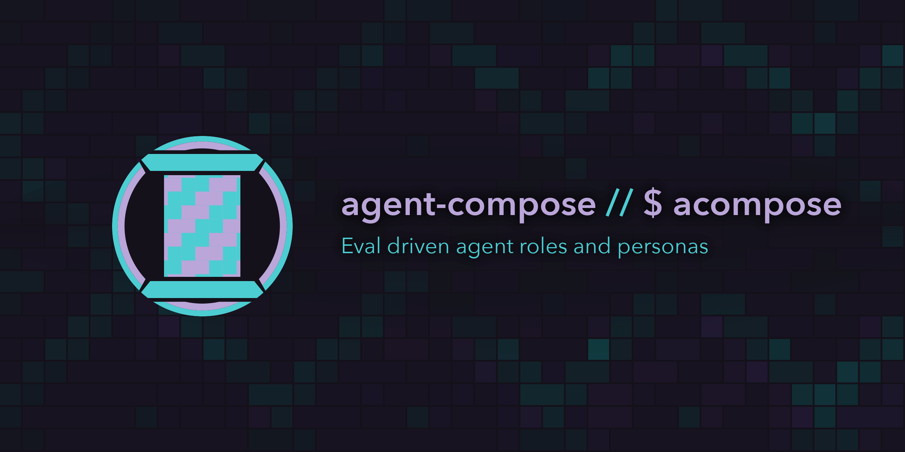

# agent-compose



`$ acompose` creates eval driven agent role and personas 

## Ownership boundary

Agent-compose owns the context boundary and its bundled public-safe Core
Roster:

* canonical role skills, role-bound methods, and shared doctrine boundaries plus role-driven personality meld resolution with host-only
  [native adaptation](docs/native-adaptation.md) for inferred roles and boundaries
* Content Creator-owned audience research, proof, community continuity,
  decision support, and communication, with external action separately authorized
* one selected roster package, with `roster:core` as the zero-config default
* external person packages that fully replace the default roster
* role-neutral personality catalog bindings, definitions, invariant, and
  curated compatibility
* complete selected-role terminal metadata, including role-stable agent
  identity, harness selectors, personality primitives, and renderer expressions
* ordinary and role-composed skill selection
* [three stable model tiers](docs/model-tiers.md) with fail-closed per-role
  compatibility and identical selected context across supported tiers
* native-skill and compiled-context delivery with source entry-point promotion
* local ordinary-skill catalogues projected through one native path
* [role-scoped providers](docs/role-scoped-providers.md) for assigned bundles
* immutable bundle materialization and caching
* harness load-point adapters and launch-time refresh
* host doctrine convergence and native skill installation
* bundle inspection, validation, and compatibility reporting
* compact text and JSON identity overlays with caller-supplied state
* a roster-derived behavior board, run through Inspect and graded by hand

Knowledge providers own reusable doctrine, general skills, capability sources,
and editorial validation. Agent-compose combines those sources with its
selected person provider to build the concrete context surface for each
harness. External person packages and private overlays remain outside this
public repo. Launch consumers own executable authority, runtime facts, mounts,
and lifecycle. Personality and operating framing never alter consumer
permissions. Infrastructure
installs the resulting system across hosts.

## Core Roster

The opinionated `roster:core` default has Engineer, Director, QA, DevOps
(`ops`), Designer (`design`), Executive Strategist (`exec`), Content
Creator (`creator`), and AI Engineer (`ai`). They operate the real
open-source, platform, community, personal, and gaming portfolio without
inventing a company or active commercial venture. Content Creator unifies the
old content, community, outreach, and sales work. Potential contracting and
SaaS work stays evidence-qualified.

Another deployment can select a complete package using the same validated
layout. The selection is exclusive: an external package contributes its own
roles, seats, personality definitions, and evaluation context without loading
`roster:core`.
An `external-only` policy makes that boundary fail closed across the machine.
See [person packages](docs/person-packages.md).

## Status

Current releases ship the Go composition engine, verified deterministic
bundles, transactional repo and container-home projection, decision
inspection, refresh-then-exec, the absorbed AOS cascade, host convergence, and
package-manager distribution. Trusted roots use `.agents/roles.kdl` for skill-provider repositories, composed skills, and strict [repository policy](docs/repository-policy.md).
Cascade compiles one availability and residency plan. Verified bundles retain repository provenance for launch consumers. Imported graphs do not recurse. The
default `roster:core` provider supplies the personality invariant, all 16
canonical definitions, and AI Engineer's cross-role evaluation methods, so its
host roster convergence needs no external personality source. A configured external person package replaces that provider
as one unit. Each Core role carries one name and pronoun pair across every
harness selector. The repository also ships a local personality palette
explorer, identity overlay, and Core Roster v2 behavior matrices.
Bare `acompose` consumes AOS-verified local catalogue roots, converges the host,
and refreshes the versioned person snapshot. `acompose -- <command>` launches with inferred
context. Assigned [native role launches](docs/native-role-launch.md) render
canonical identity colors, and bare Codex prompts its seat to introduce itself.
`acompose --reapply` rewrites the generated compose outputs and recreates
global load-point links even when they are current. `acompose --verbose`
prints every composition source and load-point file as
`source => destination`.

Composition adapters can project a verified bundle into an empty staged home,
remove agent-compose's projection state, and wrap the remaining selected load
points in their own schema. See [staged-home.md](docs/staged-home.md).

## Install

Via Homebrew (macOS and Linux):

```sh
brew tap coilyco-flight-deck/tap https://forgejo.coilysiren.me/coilyco-flight-deck/homebrew-tap.git
brew install coilyco-flight-deck/tap/agent-compose
```

Via Scoop (Windows):

```sh
scoop bucket add coilyco https://forgejo.coilysiren.me/coilyco-flight-deck/scoop-bucket.git
scoop install coilyco/agent-compose
```

Both managers also install `acompose`, which is the compose verb directly:
bare for host convergence, `acompose -- <command>` for refresh-then-exec.

Release binaries (darwin-arm64, linux-amd64/arm64, windows-amd64) also attach
to tagged
[Forgejo releases](https://forgejo.coilysiren.me/coilyco-flight-deck/agent-compose/releases)
directly. From source, `ward exec install` builds into GOBIN.
`agent-compose version` reports the build you are running.
Every push to canonical `main` validates and publishes the next minor release.

## Development

Development commands are declared in [`.ward/ward.yaml`](.ward/ward.yaml).
`ward exec test` runs the Go and palette tests plus the full pre-commit sweep.
`ward exec smoke` builds the real `acompose` entry point and converges an
isolated temporary home twice, covering roster, cascade, skills, load points,
and idempotence without touching live host state or the network. It reports each
stage. `ward exec smoke-verbose` also prints both captured convergence transcripts.
`build`, `lint`, `install`, and `tidy` cover the remaining Go verbs.

`ward exec palette-serve` generates browser data from the embedded person
source and starts the local explorer. `palette-build`, `palette-test`, and
`palette-tidy` cover its remaining development lifecycle. See
[the personality palette walkthrough](docs/personality-palette.md).

## License

Agent-compose is available under the [MIT License](LICENSE).

## See also

* [AGENTS.md](AGENTS.md) - repo-specific operating rules.
* [docs/FEATURES.md](docs/FEATURES.md) - inventory of what exists today.
* [docs/architecture.md](docs/architecture.md) - shipped composition boundary.
* [docs/staged-home.md](docs/staged-home.md) - provider-neutral adapter handoff.
* [docs/person-packages.md](docs/person-packages.md) - independent roster and evaluation packages.
* [docs/v2-migration.md](docs/v2-migration.md) - v1 provider and role destinations.
* [docs/catalogues-and-export.md](docs/catalogues-and-export.md) - rich profile inspection, reproducible archives, and logical content diff.
* [docs/evaluation.md](docs/evaluation.md) - the generator, subject, grader triple.
* [docs/release.md](docs/release.md) - automatic Forgejo release pipeline.
* [`.ward/ward.yaml`](.ward/ward.yaml) - allowlisted development commands.
* [Catalog trifecta convention](https://forgejo.coilysiren.me/coilyco-flight-deck/agentic-os/src/branch/main/docs/features-release-tooling.md) - shared catalog structure.
